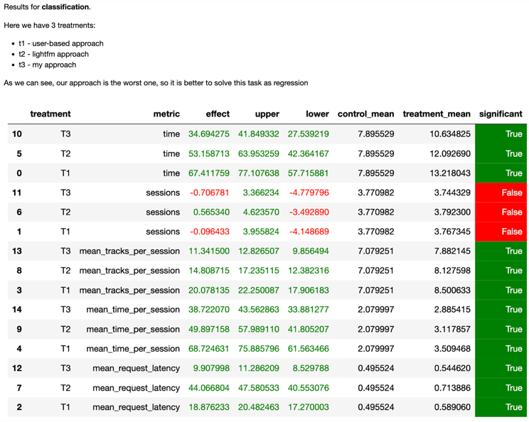
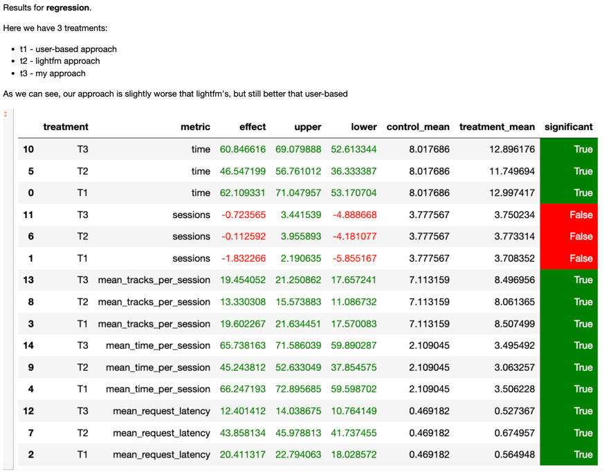

# Рекомендательные Системы в Продакшене

## Домашнее задание

(Процесс исследования подробно описан в ноутбуке solution.ipynb)

## Подход

> Основная идея: построить эмбеддинги пользователей и айтемов таким образом, чтобы их перемножение
давало вероятность, понравится ли песня пользователю или нет.

Попробуем построить эмбединги 2 способами: через задачи **классификиции и регрессии**.

Как оказалось регрессиионный подход дал лучший результат по сравнению с классификацией.

В качестве данных используем пары user-item, таргет - сколько по времени пользователь прослушал песню [0, 1].


## Результаты

### Классификация

Таргет разбиваем по трешхолду 0.8.

Получаем результаты для UB (t1), lightfm (t2) и нашим подходом (t3). (рекомендации для t1, t2, t3 получили на одних и тех не данных)




Видно что классификация работает намного хуже чем даже UB подход.


### Регрессия 

Для регрессии результат намного лучше.




## Запуск

Аналогичен запуску A/B тестов с семинара:

```commandline
cd botify
docker compose up -d --build
```

```commandline
cd sim
python sim/run.py --episodes 2000 --config config/env.yml single --recommender remote --seed 31337
docker cp recommender-container:/app/log/ ../
```